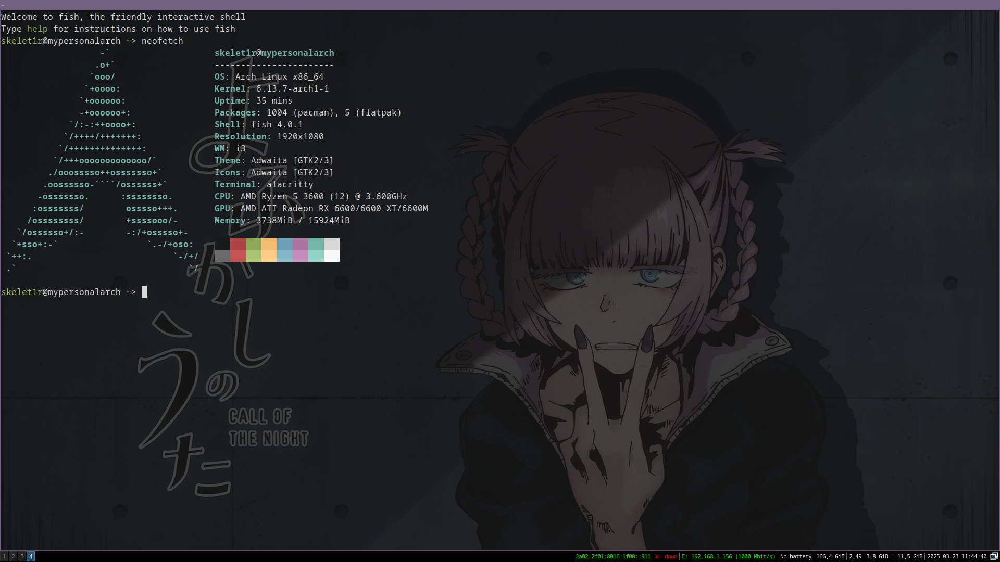

<h1>My i3 config</h1>

</img>

First, you need to install i3, after this you can use this configuration

<h2>Install packages:</h2>
<pre><code>sudo pacman -S feh flameshot alacritty neofetch</code></pre>

<h3>If you don't have alacritty.toml, create it:</h3>
<pre><code>mkdir ~/.config/alacritty/alacritty.toml</code></pre>